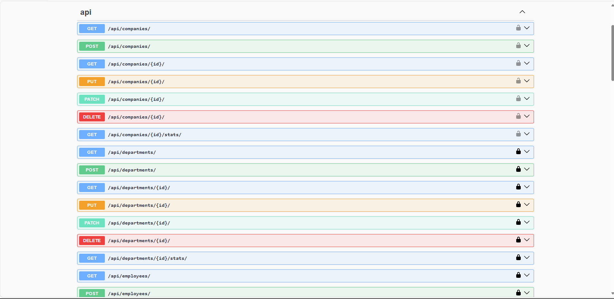
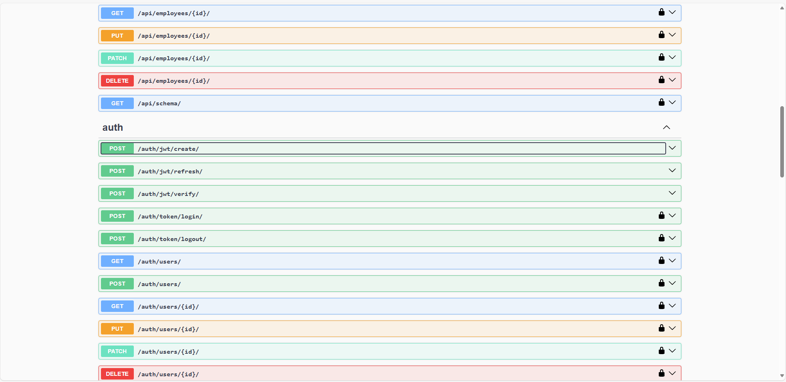
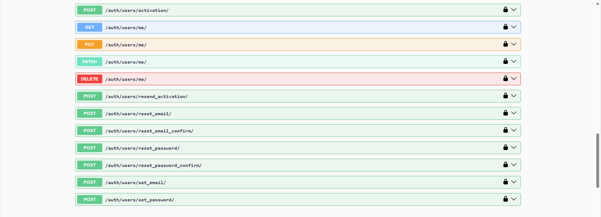

# Employees Management System with JWT Authentication

This a full stack project that has **RESTful API** built using Django and Django Rest Framework (DRF) to manage **companies**, **departments**,**employees** and **users**. It includes **user creation and management** with **JWT** tokens for authentication and authorization.

## Features

### Tasks : 
## Requirements

### 1. Back End:
- [✅] **Models:**
  - [✅ ] User Accounts
    - [✅ ] User Name
    - [ ✅] Email Address (Login ID)
    - [ ✅] Role
  - [ ✅] Company:
    - [✅ ] Company Name
    - [ ✅] Number of Departments
    - [ ✅] Number of Employees
  - [ ✅] Department:
    - [ ✅] Company (Select)
    - [ ✅] Department Name
    - [ ✅] Number of Employees
  - [ ✅] Employee:
    - [ ✅] Company (Select)
    - [ ✅] Department (Select) — Only departments related to the selected company
    - [ ✅] Employee Status — Handled through a workflow
    - [ ✅] Employee Name
    - [ ✅] Email Address
    - [✅ ] Mobile Number
    - [✅ ] Address
    - [ ✅] Designation (Position/Title)
    - [ ✅] Hired On — Only if hired
    - [ ✅] Days Employed — Only if hired
- [ ] **Validations & Business Logic:**
  - [✅ ] Validate all required fields are filled
  - [ ] Validate email addresses and mobile numbers are in the correct format
  - [✅ ] Automatically calculate the number of departments and employees in the company
  - [✅ ] Automatically calculate the number of employees in the department
  - [✅ ] Automatically calculate the number of days an employee has been with the company based on the hiring date
  - [ ✅] Ensure that the Department field in Employee models only accepts departments related to the selected company
  - [ ✅] Handle cascading deletions by ensuring either related records are properly managed or preventing the deletion if necessary
  - [✅ ] Handle errors and throw appropriate error codes and messages accordingly
- [✅ ] **Security & Permissions:**
  - [✅ ] Implement role-based access control to ensure:
    - [✅ ] Only authorized personnel can view and edit data
    - [✅ ] Different roles have different levels of access (e.g., Admin, Manager, Employee)
  - [✅ ] Use secure authentication and authorization mechanisms of your choice (e.g., Sessions, Tokens)
- [ ] **APIs:**
  - [ ✅] Create a RESTful API that supports all CRUD operations for all models:
    - [ ✅] Company
      - [✅ ] GET: Retrieve a single company or list all companies
    - [ ✅] Department
      - [✅ ] GET: Retrieve a single department or list all departments
    - [✅ ] Employee
      - [✅ ] POST: Create a new employee
      - [ ✅] GET: Retrieve a single employee or list all employees
      - [ ✅] PATCH: Update an existing employee
      - [ ✅] DELETE: Delete an employee
  - [ ] Ensure the API handles data securely
- [ ] **Testing:**
  - [ ✅] Ensure the API follows RESTful conventions (e.g., using proper HTTP methods like GET, POST, etc.)
  - [ ✅] If applicable, provide clear documentation on the API endpoints, parameters, and expected responses
  - [ ] Include unit tests to validate individual components and functions
  - [ ] Include integration tests to ensure different parts of the application work together correctly

### 2. Front End:
- [ ] **User Interface (UI):**
  - [ ] Develop a user interface to interact with all system features:
    - [ ✅] Login Page: A landing page where users can log in using their credentials
    - [ ] Company Management:
      - [✅ ] List Companies Page: Display a list of all companies with options to view, edit, and delete each company
      - [✅ ] View Company Page: View detailed information of a single company
    - [ ] Department Management:
      - [✅ ] List Departments Page: Display a list of all departments with options to view, ❌edit, ❌and delete each department
      - [ ] View Department Page: View detailed information of a single department
    - [ ] Employee Management:
      - [ ] List Employees Page: Display a list of all employees with options to view, edit, and delete each employee
      - [✅ ] Create Employee Page: Form to create a new employee
      - [ ✅] Edit Employee Page: Form to edit an existing employee
      - [ ] View Employee Page: View detailed information of a single employee
- [ ] **Validations:**
  - [ ] Validate all required fields are filled
  - [ ✅] Validate email addresses and mobile numbers are in the correct format
  - [ ✅] Ensure that the Department field in Employee page only shows departments related to the selected company
  - [✅ ] Handle errors and show appropriate & user-friendly messages

### Why JWT was chosen? :
To enhance security  in such confidentail application and to have better performance with large number of users.
- **RESTful API Endpoints**:
  - **Companies**: List, create, update, delete companies.
  - **Departments**: List, create, update, delete departments.
  - **Employees**: List, create, update, delete employees.
  - **User Management**: User creation, authentication, and role-based access control using JWT tokens.

- **JWT Authentication**:
  - Users can log in using email and password.
  - JWT tokens (access and refresh tokens) are generated for authenticated users.
  - The token is used for subsequent requests to ensure secure access.

- **Signal Handlers**:
  - **Adding a new department** automatically updates the number of employees in the department.
  - **Adding a new company** automatically updates the number of departments in the company.

- **Role-Based Access Control**:
  - **Admin** or **Manager** users can:
    - Add, update, and delete employees.
    - Add new companies and departments.
    - Admin should add managers ,but managers can't.
  - Other users can view data but cannot modify it.

- **Swagger Documentation**:
  - Integrated with **Swagger** for interactive API documentation.

##  Example of API Endpoints

### **Authentication Endpoints**

- **Login**: `POST /api/auth/jwt/create/`  
  Request body:  
  ```json
  {
    "email": "user@example.com",
    "password": "password123"
  }

**Company Endpoints**

- List Companies: GET /api/companies/

- Create Company: POST /api/companies/
Request body:
    ```json
    {
        " name": "New Company",
        "description": "A   description of the new company"
    }


**Department Endpoints**
- List Departments: GET /api/departments/

- Create Department: POST /api/departments/


**Endpoints from swagger**

!

!


!

# Example run of front-end app 

!

Details of front-end and how to run it  is in frontend folder:

[Frontend README](FRONT-END/README.md)

### Setup of Back-END:
- install pipenv to manage dependency 
- run in EmploYEEMangementSystem
```bash
pipenv install -r requirements.txt or pip install -r requirements.txt
```

 To create roles for Manager , Admin , employee with their permissions without manual work in Admin panel.
```bash
python manage.py setup_roles_and_permissions 
```
```bash
 python makemigrations
```

 ```bash
 run python migrate
```
This will create user for you to create test accounts
```bash

 
 python manage.py createsuperuser
 ```
```bash
python manage.py runserver to start the project
```
To view all possible endpoints

Go to this url :

To view the swagger ui for all APIs

```bash
127.0.0.1:8000/api/docs 
```


 
